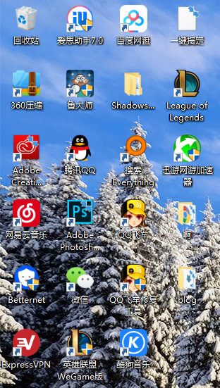

## 1.标题
# 代码展示

## 2.一行代码

    var a = 5

## 3.多行代码

```javascript
var a = 5
console.log(a)
```
## 4.有序列表

    1.第一项
    2.第二项

## 5.无序列表

* golang
* c++
* python
* java
* javascript
* php
  
  
  
## 6.这是我的图片

